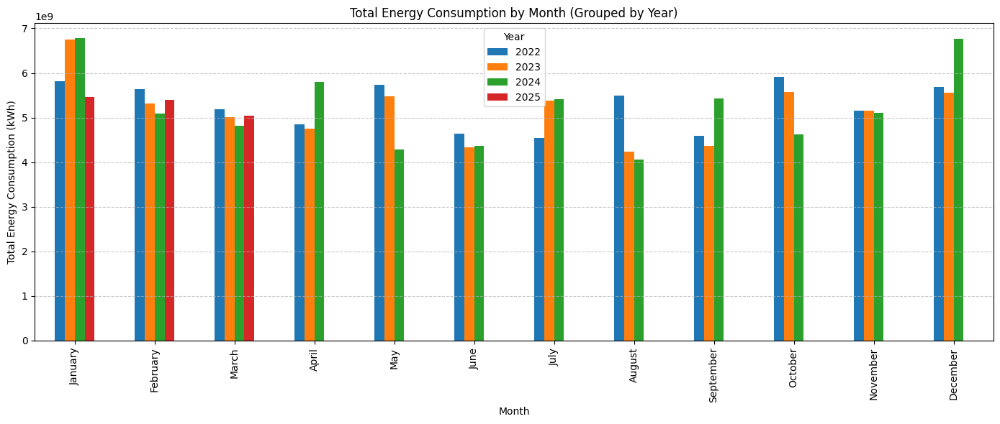

# Thesis-Website ⛬

This is a web visualization of my 2025 Bachelor thesis:  
**Power Grid Load Forecasting using Machine Learning Approaches**

It presents interactive, rolling forecasts of weekly Swiss energy consumption using statistical time series models and supervised machine learning models, with a focus on seasonality, weather effects, and medium-range load forecasting.

## Overview 

The tool is based on historical data from Swissgrid and weather forecasts from ECMWF. It uses a rolling 8-week-ahead forecasting setup and compares classical time-series models against machine learning models trained on lagged consumption, rolling statistics, calendar seasonality, and temperature.

The monthly energy consumption figure below shows the seasonal structure of the data before the forecasting models are introduced.

## Features 

- Medium-range (8-week) energy load forecasting
- Seasonal naive baseline, AR, ARIMA, SARIMA, and SARIMAX models
- Ridge Regression, Random Forest, and XGBoost models using supervised lag features
- SARIMAX(1,0,0)(1,0,0,52) model with ECMWF temperature integration
- Rolling forecast retrained weekly on 2 years of past data
- Clean residual diagnostics confirmed via KS tests and periodograms
- Interactive Plotly.js visualizations of forecast vs. actuals
- Monthly energy consumption overview figure
- Built with Next.js and styled using Tailwind CSS

## Tech Stack 

- **Next.js** — frontend framework  
- **Tailwind CSS** — responsive styling  
- **Plotly.js** — interactive charts  
- **Python (offline)** — model training and data prep  

Explore the interactive forecasts on the [website](https://energy-forecast.netlify.app).
